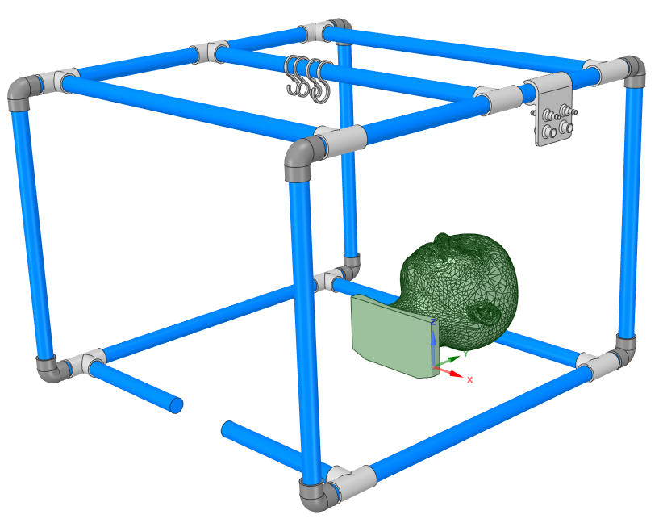
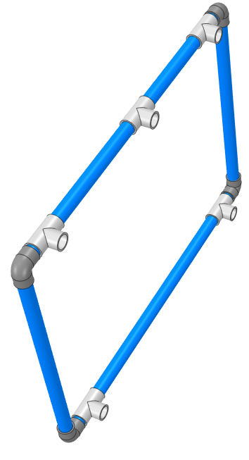
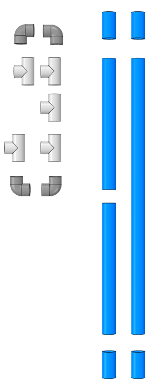
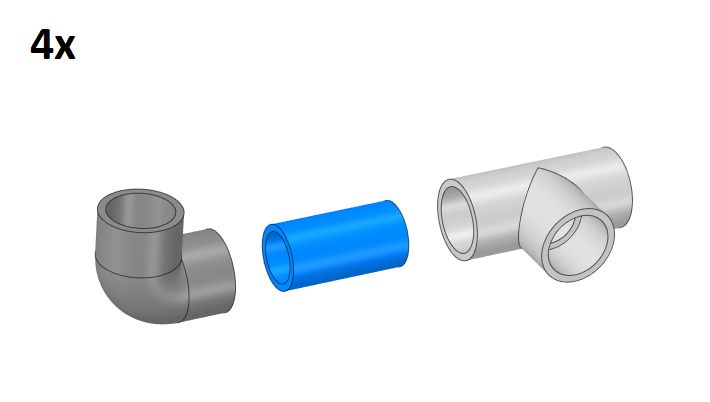
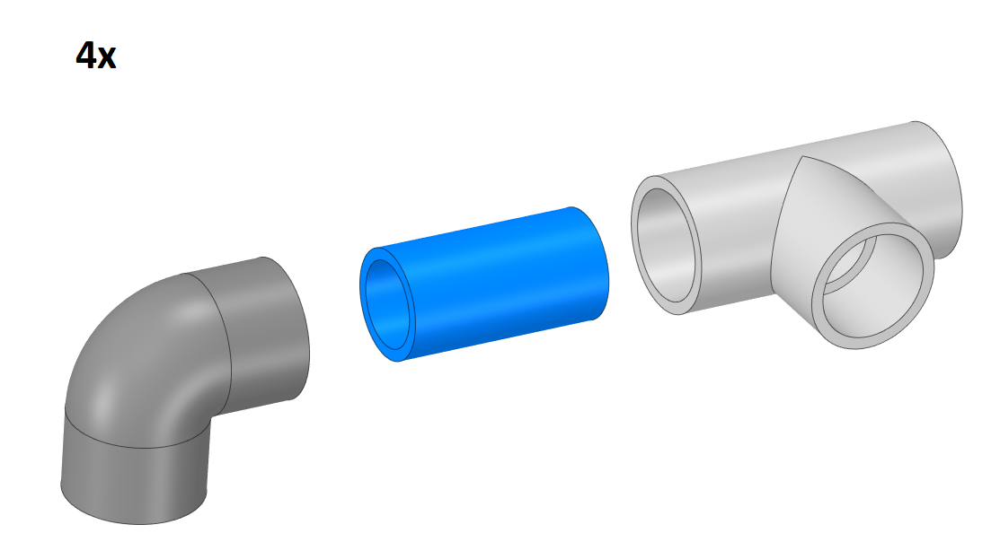
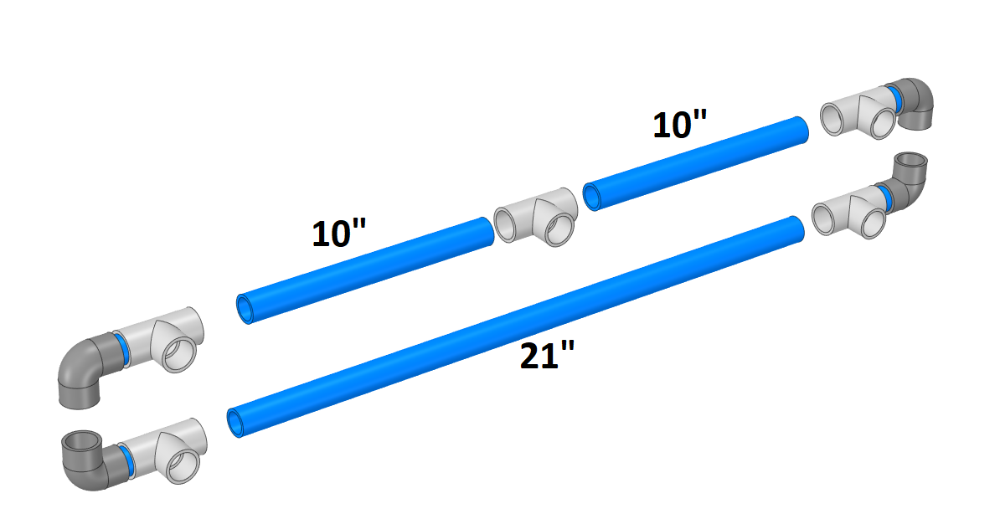
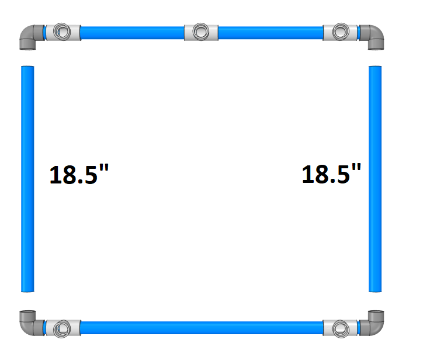
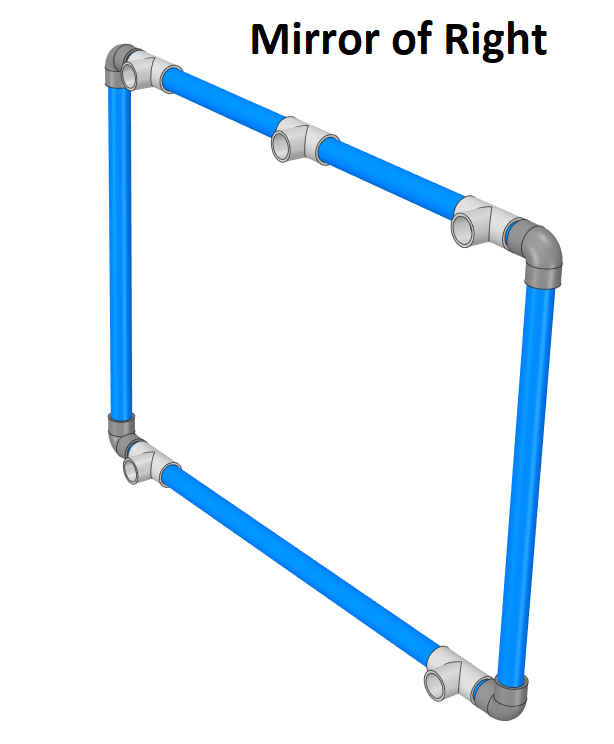
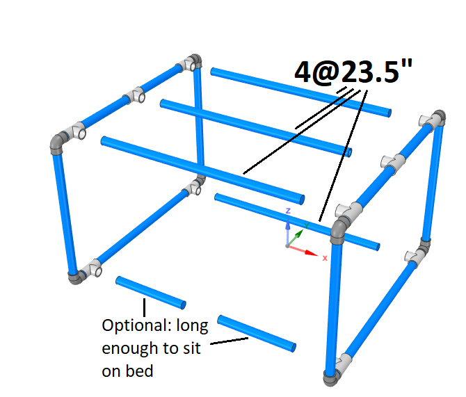

[ - Main Page](../README.md)

# "Hardware Store" Cage
This design is intended to be built using strictly parts that would most likely be available at your local hardware store. A number of 3D printed pieces are included as optional enhancements, but are not necessary for the basic structure.

## North American
Design based on 3/4" ID PVC plumbing pipe

### Materials
- 3/4" pipe sections (example: [https://www.mcmaster.com/48925k12](https://www.mcmaster.com/48925k12]))
  - corner assemblies
    - 8@ 2"
  - side joins
    - 4@ 23.5"
  - side verticals
    - 4@ 18.5"s
  - side horizontals
    - 2@ 21"
    - 4@ 10.5"
  - Optional: 2@ length determined by bed/patient/mounting system (see assembly instructions for detail)
- 3/4" pipe fittings
  - 8@ 90deg female-female (example: [https://www.mcmaster.com/4880k22](https://www.mcmaster.com/4880k22))
  - 10@ Tee: female-female-female (example: [https://www.mcmaster.com/4880k42](https://www.mcmaster.com/4880k42))

### Assembly

First left side, then right side, then join them together.

#### Right Side: Preview

##### Materials
Per side:

##### Steps

1. Build corner assemblies by gluing a 2" section to a corner and a tee fitting. Ensure that the corner bend direction is perpendicular to the tee perpendicular fitting (see image). Create 4 of these (2 per side).

1. Similarly to the first step, create 4 more corner assemblies, but with the tee bracket turned 180 degrees from your first 4.

1. Glue the corner pieces into two horizontal assemblies, the top one having a tee fitting in between two 10" sections of pipe, and the bottom one consisting solely of a 21" piece of pipe.

1. Glue the two horizontal assemblies together using two 18.5" pieces of pipe.

#### Left Side

Repeat but assembly corners such that they form a mirror of the right side.

#### Combine Sides
**Do not glue!** Use 23.5" pipes to join two sides. Pipes are left unglued to allow for diassembly and compact storage.

### Optional Pieces
1. [Air/suction port corner bracket]()
1. [Air/suction port snap-on bracket]()
1. [S-hooks]()

## European/Metric
For those who work with the metric system, replace all 3/4" pipe and fittings with DN 20mm rigid PVC pipe or nearest equivalent that is easily sourced near you.
