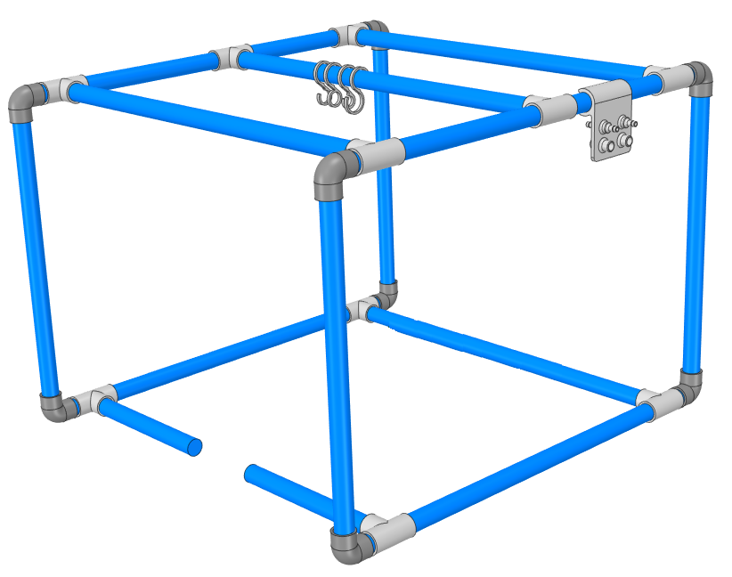

# "Hardware Store" Cage
This design is intended to be built using strictly parts that would most likely be available at your local hardware store. A number of 3D printed pieces are included as optional enhancements, but are not necessary for the basic structure.

## North American
Design based on 3/4" ID PVC plumbing pipe

### Materials
- 3/4" pipe sections (example: [https://www.mcmaster.com/48925k12](https://www.mcmaster.com/48925k12]))
  - 8@ 2"
  - 4@ 23.5"
  - 4@ 18.5"s
  - 2@ 21"
  - 4@ 1023."
  - Optional: 2@ length determined by bed/patient/mounting system (see assembly for detail)
- 3/4" pipe fittings
  - 8@ 90deg female-female (example: [https://www.mcmaster.com/4880k22](https://www.mcmaster.com/4880k22))
  - 10@ Tee: female-female-female (example: [https://www.mcmaster.com/4880k42](https://www.mcmaster.com/4880k42))

### Assembly

## European
Help! Smallest rigid pipe I could find was 40mm. Do all europeans use flexible supply pipe?
