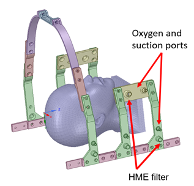
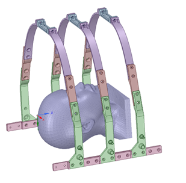

[ - Main Page](../README.md)

# 3D Printed Rib Cage
This design is intended to be built using 3D printed, modular parts. Two example designs are presented here, but the idea is that any combination can be used as needed.

## Materials
- 3D printed parts:
  - ABS or PETG recommended as a printing material for cleaning purposes
  - PLA is not recommended due to its lower glass transition and melting points
- Hardware:
  - Use any of: M5x15, 10-24x5/8" or 10-32x5/8" with corresponding nylon lock-nut

## Printing
- Parts are designed to be printed on hobby grade 3D printers, use settings as recommended by your printer and filament guidelines

### Parts
- [VentilatorFrame_BaseLong](../Models/VentilatorFrame_BaseLong.stl)
- [VentilatorFrame_BaseShort](../Models/VentilatorFrame_BaseShort.stl)
- [VentilatorFrame_VerticalPost](../Models/VentilatorFrame_VerticalPost.stl)
- [VentilatorFrame_VerticalExtension](../Models/VentilatorFrame_VerticalExtension.stl)
- [VentilatorFrame_HalfArch](../Models/VentilatorFrame_HalfArch.stl)
- [VentilatorFrame_WholeArch](../Models/VentilatorFrame_WholeArch.stl)
- [VentilatorFrame_ArchSpacer](../Models/VentilatorFrame_ArchSpacer.stl)
- [VentilatorFrame_IOPort](../Models/VentilatorFrame_IOPort.stl)

## Sample Arrangements
Presented here are some sample arrangements that may be useful for your needs:

### Example 1
This design features an IO port and easy access to the face at the expense of patient comfort

#### Preview

#### Quantities
- 6@ VentilatorFrame_VerticalPost
- 2@ VentilatorFrame_VerticalExtension (optional, repeat as many as necessary)
- 2@ VentilatorFrame_IOPort
- 2@ VentilatorFrame_HalfArch
- 1@ VentilatorFrame_ArchSpacer (optional, repeat as many as necessary)
- 2@ VentilatorFrame_BaseShort
- 2@ VentilatorFrame_BaseLong

### Example 2
This design features an IO port and easy access to the face at the expense of patient comfort

#### Preview

#### Quantities
- 6@ VentilatorFrame_VerticalPost
- 6@ VentilatorFrame_VerticalExtension (optional, repeat as many as necessary)
- 6@ VentilatorFrame_HalfArch
- 3@ VentilatorFrame_ArchSpacer (optional, repeat as many as necessary)
- 2@ VentilatorFrame_BaseShort
- 2@ VentilatorFrame_BaseLong
